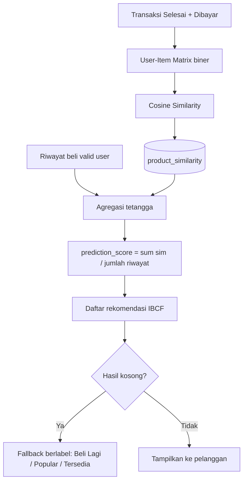

# Toko Sinar Manis — Sistem Rekomendasi Produk

Aplikasi toko online kebutuhan sehari-hari dengan modul **rekomendasi produk berbasis Item-Based Collaborative Filtering**. Sistem mempelajari pola pembelian pelanggan dari data transaksi, menghitung kemiripan antarproduk (cosine similarity), lalu menyarankan produk yang relevan.

> Studi kasus: *Pengembangan Sistem Rekomendasi Produk Berdasarkan Data Transaksi Pelanggan menggunakan Item-Based Collaborative Filtering dan Cosine Similarity — Toko Sinar Manis.*

---

## Fitur Utama

### Pelanggan
- Katalog produk **dengan gambar**, detail produk, dan keranjang belanja (session)
- Checkout dengan metode **Bayar di Toko** atau **Midtrans Snap** (GoPay, VA, kartu, dll.)
- Riwayat transaksi + verifikasi status pembayaran Midtrans
- Halaman rekomendasi personal (`/rekomendasi`)
- Produk serupa di halaman detail produk
- Gambar produk tampil di katalog, home, detail, rekomendasi, keranjang, dan riwayat

### Admin
- Dashboard, kelola produk (**upload gambar** per produk), pelanggan, transaksi, ulasan, dan laporan
- Import produk CSV dengan kolom opsional `foto` (path relatif di `storage/app/public`)
- Analisis CF + tombol **Hitung Ulang** kemiripan produk
- Upload data transaksi (CSV/Excel) lewat pipeline Python (ETL + CF)
- Riwayat upload dan log perhitungan CF

---

## Tech Stack

| Komponen | Teknologi |
|----------|-----------|
| Backend | Laravel 12, PHP 8.2+ |
| Pembayaran | Midtrans Snap (`midtrans/midtrans-php`) |
| Database | MySQL (disarankan) / SQLite untuk development Laravel |
| Frontend | Blade, Vite, Tailwind CSS |
| Pipeline data | Python 3 (pandas, NumPy, PyMySQL, SQLAlchemy, openpyxl) |
| Deploy VPS | Docker Compose (PHP + Nginx + MySQL + Python venv) |

---

## Struktur Folder Penting

```
app/
  Http/Controllers/          # Web (customer + admin)
  Http/Controllers/Api/      # Cart, Midtrans, similarity, pipeline
  Services/
    RecommenderService.php   # CF runtime (PHP)
    MidtransPaymentService.php
    UploadService.php        # Trigger pipeline Python
  Models/
database/migrations/         # Skema domain utama
python/
  pipeline/                  # ETL: ingest → clean → load
  cf/                        # CF engine (cosine biner, NumPy/pandas)
resources/views/customer/    # Tampilan toko
resources/views/admin/       # Panel admin
routes/web.php
routes/api.php
storage/app/public/products/ # Gambar produk (diakses via /storage/products/...)
storage/app/uploads/         # File upload (raw / processed / logs)
public/uploads/templates/    # Template CSV import produk
docker/                      # Nginx, supervisord, entrypoint (deploy Docker)
```

---

## Setup di Device Baru

> **Mulai dari sini** jika Anda clone repo ini di laptop/PC/VPS baru. Pilih **satu** jalur di bawah.

### Jalur A — Development lokal (Laragon / XAMPP / manual)

**Prasyarat:** PHP 8.2+, Composer, Node.js, MySQL (wajib untuk pipeline Python), Python 3 + pip (opsional, untuk upload transaksi)

```bash
# 1. Clone & masuk folder proyek
git clone https://github.com/muhzule113/rekomendasi_produk_laravel.git
cd rekomendasi_produk_laravel

# 2. Dependency PHP
composer install

# 3. Environment
cp .env.example .env
php artisan key:generate

# 4. Database — edit .env (contoh MySQL)
# DB_CONNECTION=mysql
# DB_HOST=127.0.0.1
# DB_PORT=3306
# DB_DATABASE=db_sinar_manis
# DB_USERNAME=root
# DB_PASSWORD=

# 5. Migrasi & symlink gambar produk
php artisan migrate
php artisan storage:link

# 6. (Opsional) Frontend Vite — UI memakai public/assets/ statis, npm tidak wajib
# npm install && npm run build

# 7. Jalankan
php artisan serve
# atau serve + queue + vite sekaligus:
composer run dev
```

**Checklist device baru (lokal):**

| # | Langkah | Wajib? |
|---|---------|--------|
| 1 | `composer install` | Ya |
| 2 | Copy `.env` + `php artisan key:generate` | Ya |
| 3 | Set `DB_*` di `.env` | Ya |
| 4 | `php artisan migrate` | Ya |
| 5 | `php artisan storage:link` | Ya (gambar produk) |
| 6 | `npm install && npm run build` | Tidak (UI pakai `public/assets/`; npm hanya jika develop Vite) |
| 7 | `pip install -r python/requirements.txt` | Hanya jika pakai upload transaksi |
| 8 | Set `PYTHON_BIN` & `PIPELINE_SCRIPT` di `.env` | Hanya jika pakai upload transaksi |

Jika memakai Laragon / virtual host, arahkan document root ke folder `public/`.

---

### Jalur B — Production VPS (Docker)

**Prasyarat:** Git, Docker & Docker Compose di VPS. Python **sudah otomatis** terpasang di image Docker (tidak perlu `pip install` manual).

```bash
# 1. Clone di VPS
git clone https://github.com/muhzule113/rekomendasi_produk_laravel.git
cd rekomendasi_produk_laravel

# 2. Environment Docker
cp .env.docker.example .env

# 3. Build image dulu
docker compose build

# 4. Generate APP_KEY ke .env
docker compose run --rm app php artisan key:generate --show
# Salin output, tempel sebagai APP_KEY=... di .env

# 5. Edit .env — minimal:
# APP_KEY=base64:...
# APP_URL=http://IP_VPS_ANDA
# DB_PASSWORD=... (ganti password default)
# DB_ROOT_PASSWORD=...

# 6. Jalankan
docker compose up -d

# 7. Cek log
docker compose logs -f app
```

**Checklist device baru (Docker/VPS):**

| # | Langkah | Wajib? |
|---|---------|--------|
| 1 | `cp .env.docker.example .env` + isi `APP_KEY`, `APP_URL` | Ya |
| 2 | Ganti `DB_PASSWORD` & `DB_ROOT_PASSWORD` | Ya |
| 3 | `docker compose build && docker compose up -d` | Ya |
| 4 | Pastikan port `APP_PORT` (default 80) terbuka di firewall | Ya |
| 5 | `PYTHON_BIN=/opt/venv/bin/python` sudah di `.env.docker.example` | Otomatis |
| 6 | Pull update: `git pull && docker compose build && docker compose up -d` | Saat deploy ulang |

Container `app` menjalankan migrasi & `storage:link` otomatis lewat `docker/entrypoint.sh`. Service `queue` menjalankan `php artisan queue:work`.

---

## Instalasi & Konfigurasi Lanjutan

### Gambar produk

Gambar disimpan di `storage/app/public/products/` dan diakses via URL `/storage/products/nama-file.webp`.

| Cara | Keterangan |
|------|------------|
| Admin → Produk → Tambah/Edit | Upload file gambar langsung |
| Import CSV produk | Kolom opsional `foto` — path relatif, contoh `products/nama.jpg`. File harus sudah ada di `storage/app/public/` |
| Tanpa gambar | Tampil emoji kategori sebagai placeholder |

Pastikan symlink sudah dibuat:

```bash
php artisan storage:link
```

Template CSV: `public/uploads/templates/template_produk.csv`

### Dependency Python (hanya jalur lokal / non-Docker)

```bash
cd python
pip install -r requirements.txt
```

`python/config.py` membaca kredensial database dari variabel lingkungan (`DB_HOST`, `DB_USERNAME`, `DB_PASSWORD`, `DB_DATABASE`) — sama dengan `.env` Laravel. Pastikan variabel tersebut tersedia saat pipeline dijalankan (Docker Compose sudah meneruskannya otomatis).

### Variabel lingkungan

Contoh tambahan di `.env`:

```env
# Midtrans (sandbox)
MIDTRANS_SERVER_KEY=SB-Mid-server-xxxx
MIDTRANS_CLIENT_KEY=SB-Mid-client-xxxx
MIDTRANS_IS_PRODUCTION=false

# Pipeline upload transaksi (lokal)
PYTHON_BIN=python
PIPELINE_SCRIPT=python/pipeline/pipeline_runner.py

# Pipeline upload transaksi (Docker — sudah ada di .env.docker.example)
# PYTHON_BIN=/opt/venv/bin/python
# PIPELINE_SCRIPT=python/pipeline/pipeline_runner.py
```

**Notification URL Midtrans (production/ngrok):**  
`https://domain-anda/api/midtrans/notification`

---

## Workflow Aplikasi

### 1. Alur belanja pelanggan

```
Browse produk → Tambah keranjang → Checkout
       ↓
  Bayar di Toko          Midtrans Snap
       ↓                      ↓
  Menunggu admin         Bayar di popup Snap
  konfirmasi             → verify-payment / webhook
       ↓                      ↓
  Stok berkurang saat    Stok berkurang saat status
  checkout (non-Midtrans) settlement / capture
       ↓
  Riwayat transaksi → (opsional) rekomendasi diperbarui
```

### 2. Alur admin data & rekomendasi

```
Upload CSV/Excel transaksi (Admin → Upload)
       ↓
Python ETL (pipeline_runner)
       ↓
Load ke MySQL + jalankan CF engine (Python)
       ↓
Tabel product_similarity terisi
       ↓
Halaman /rekomendasi memakai skor kemiripan

ATAU

Admin → Analisis → Hitung Ulang
       ↓
RecommenderService (PHP): matrix → cosine → saveSimilarity
```

### 3. Role

| Role | Akses |
|------|--------|
| `pelanggan` | Toko, keranjang, checkout, riwayat, rekomendasi |
| `admin` | `/admin/*` (katalog, transaksi, analisis, upload) |

Registrasi publik hanya membuat akun **pelanggan**.

---

## Mekanisme Sistem Rekomendasi

Inti logika ada di `App\Services\RecommenderService`.

### Ringkasan arsitektur



### 1. Membangun User–Item Matrix

Method: `buildUserItemMatrix()`

- Sumber: `transactions` + `transaction_items`
- Filter: `status_pesanan = Selesai` **dan** `status_pembayaran = Dibayar`
- Nilai: **binary** (1 = pernah membeli produk, 0 = belum)
- Kolom: hanya produk berstatus `aktif`

### 2. Cosine Similarity & Co-occurrence

Method: `calculateCosineSimilarity()` / Python `compute_cosine_similarity()`

Untuk vektor interaksi biner:

```text
cosine(A, B) = |buyers(A) ∩ buyers(B)| / sqrt(|buyers(A)| × |buyers(B)|)
```

- Skor cosine asli pada rentang 0–1 (**tanpa** normalisasi terhadap skor maksimum katalog)
- Pasangan dengan skor 0 atau diagonal tidak disimpan
- Ambang `CF_MIN_CO_OCCURRENCE` (default `2`) memfilter co-occurrence rendah
- Rating, harga, stok, dan popularitas **tidak** masuk perhitungan skor CF

### 3. Menyimpan hasil ke database

Method: `saveSimilarity()`

- Penggantian tabel secara atomik (transaksi DB); gagal → rollback, data lama utuh
- Pasangan disimpan dua arah (`product_a` ↔ `product_b`)
- Sukses menghitung → `recommendation_dirty = 0`

### 4. Skor prediksi rekomendasi personal

Method: `recommendForCustomer()`

1. Ambil seluruh produk valid yang pernah dibeli user
2. Kumpulkan seluruh tetangga dari `product_similarity`
3. Kecualikan produk yang sudah dibeli
4. Agregasi per kandidat **sebelum** limit:

```text
prediction_score(user, candidate)
  = sum(similarity(purchased_item, candidate))
    / jumlah_produk_valid_yang_pernah_dibeli_user
```

5. Urutkan `prediction_score` menurun; tie-breaker: co-occurrence, lalu `id_product`
6. Filter kelayakan tampil: `status = aktif` dan `stok > 0`
7. Alasan contoh: *"Direkomendasikan berdasarkan kemiripan pola pembelian dengan Indomie Goreng."*

Rating boleh ditampilkan di kartu produk, tetapi **tidak** memengaruhi skor/filter IBCF.

### 5. Cold start & fallback (bukan CF)

| Kondisi | Method label | Log source |
|---------|--------------|------------|
| Belum ada riwayat valid | Cold Start - Popularitas/Rating (bukan CF) | `cold_start_popular` |
| Ada riwayat + IBCF berhasil | Item-Based CF - Cosine Similarity | `ibcf_cosine` |
| IBCF kosong | Beli Lagi (Fallback, bukan CF) | `buy_again` |
| Masih kosong | Cold Start / Produk Tersedia (bukan CF) | `cold_start_popular` / `available_fallback` |

### 6. Evaluasi akademik

Python `cf/evaluator.py` memakai holdout berbasis waktu per pelanggan, membangun ulang similarity **hanya dari data latih** (tanpa membaca tabel similarity produksi), lalu menghitung Precision@K, Recall@K, F1@K, Hit Rate@K, dan Catalog Coverage@K (K=5 dan 10). Hasil disimpan di `evaluation_logs`.

- **Pair coverage**: % pasangan produk yang punya kemiripan di model
- **Catalog coverage@K**: % katalog yang muncul di Top-K evaluasi

### 7. Kapan similarity dihitung ulang?

| Pemicu | Cara |
|--------|------|
| Tombol **Hitung Ulang** di Admin → Analisis | `POST /admin/similarity` → PHP `RecommenderService` |
| Upload file transaksi | Pipeline Python → `cf_engine.py` (cosine biner yang sama) |

Flag `recommendation_dirty` diset saat transaksi valid berubah, ditampilkan di Admin → Analisis, dan dibersihkan hanya setelah kalkulasi berhasil.

### 8. PHP vs Python CF

Kedua mesin memakai rumus, filter transaksi, ambang co-occurrence, dan matriks biner yang sama (toleransi skor `1e-6`).

| Aspek | PHP | Python |
|-------|-----|--------|
| Filter | Selesai + Dibayar | Selesai + Dibayar |
| Representasi | Binary | Binary |
| Rumus | Cosine manual | Cosine NumPy |
| Pemicu | Admin Hitung Ulang | Setelah upload / batch |

### 9. Endpoint terkait rekomendasi

| Endpoint | Fungsi |
|----------|--------|
| `GET /rekomendasi` | Halaman rekomendasi personal + produk populer |
| `GET /produk/{id}` | Detail + produk serupa |
| `POST /admin/similarity` | Hitung ulang cosine similarity (admin) |
| `GET /api/rekomendasi` | API: `similar` / `personal` / `popular` |
| `POST /api/review` | Ulasan produk (session web, role pelanggan) |

---

## Alur Pembayaran Midtrans (ringkas)

1. Checkout memilih **Online Payment (Midtrans)** → transaksi dibuat status `Pending`
2. Snap token dibuat → popup pembayaran Midtrans
3. Setelah bayar, status disinkronkan lewat:
   - Webhook `POST /api/midtrans/notification`, dan/atau
   - `POST /verify-payment` (otomatis dari halaman checkout/riwayat)
4. Status `settlement` / `capture` sukses → `Dibayar` + `Diproses`, stok berkurang

Di lingkungan lokal, pastikan webhook dapat dijangkau Midtrans (ngrok/domain publik), atau andalkan verifikasi client (`verify-payment`).

---

## Akun & data awal

Kredensial admin **tidak** di-hardcode di repository. Buat admin development dari environment:

```bash
# isi di .env: ADMIN_EMAIL, ADMIN_PASSWORD, ADMIN_NAME
php artisan app:create-admin
```

Pelanggan dapat mendaftar lewat form register. Role di tabel `users`: `admin` | `pelanggan`.

## Pengujian

```bash
php artisan test
py -3 -m unittest discover -s python/tests -v
```

---

## Lisensi

Proyek ini dibangun di atas [Laravel](https://laravel.com) (MIT). Kode aplikasi Toko Sinar Manis mengikuti kebutuhan studi kasus proyek.
