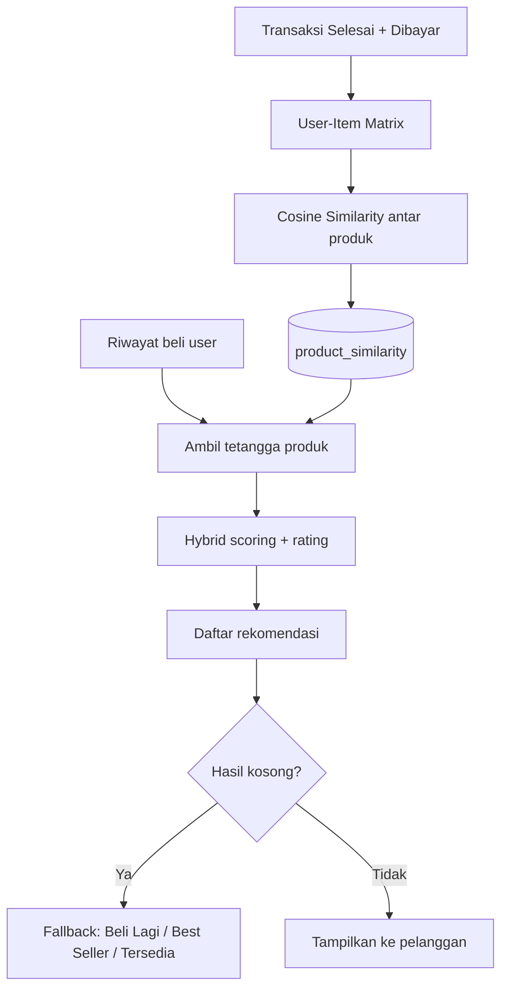

# Toko Sinar Manis — Sistem Rekomendasi Produk

Aplikasi toko online kebutuhan sehari-hari dengan modul **rekomendasi produk berbasis Item-Based Collaborative Filtering**. Sistem mempelajari pola pembelian pelanggan dari data transaksi, menghitung kemiripan antarproduk (cosine similarity), lalu menyarankan produk yang relevan.

> Studi kasus: *Pengembangan Sistem Rekomendasi Produk Berbasis Analisis Big Data terhadap Transaksi Pelanggan — Toko Sinar Manis.*

---

## Fitur Utama

### Pelanggan
- Katalog produk, detail produk, dan keranjang belanja (session)
- Checkout dengan metode **Bayar di Toko** atau **Midtrans Snap** (GoPay, VA, kartu, dll.)
- Riwayat transaksi + verifikasi status pembayaran Midtrans
- Halaman rekomendasi personal (`/rekomendasi`)
- Produk serupa di halaman detail produk

### Admin
- Dashboard, kelola produk, pelanggan, transaksi, ulasan, dan laporan
- Analisis CF + tombol **Hitung Ulang** kemiripan produk
- Upload data transaksi (CSV/Excel) lewat pipeline Python (ETL + CF)
- Riwayat upload dan log perhitungan CF

---

## Tech Stack

| Komponen | Teknologi |
|----------|-----------|
| Backend | Laravel 12, PHP 8.2+ |
| Pembayaran | Midtrans Snap (`midtrans/midtrans-php`) |
| Database | MySQL (disarankan) / SQLite untuk development Laravel |
| Frontend | Blade, Vite, Tailwind CSS |
| Pipeline data | Python 3 (pandas, numpy, scikit-learn, pymysql) |

---

## Struktur Folder Penting

```
app/
  Http/Controllers/          # Web (customer + admin)
  Http/Controllers/Api/      # Cart, Midtrans, similarity, pipeline
  Services/
    RecommenderService.php   # CF runtime (PHP)
    MidtransPaymentService.php
    UploadService.php        # Trigger pipeline Python
  Models/
database/migrations/         # Skema domain utama
python/
  pipeline/                  # ETL: ingest → clean → load
  cf/                        # CF engine (scikit-learn)
resources/views/customer/    # Tampilan toko
resources/views/admin/       # Panel admin
routes/web.php
routes/api.php
storage/app/uploads/         # File upload (raw / processed / logs)
```

---

## Instalasi & Setup

### Prasyarat
- PHP 8.2+, Composer, Node.js
- MySQL (wajib jika memakai upload/CF Python)
- Python 3 + pip (opsional, untuk pipeline upload)

### Langkah

```bash
# 1. Install dependency PHP
composer install

# 2. Environment
cp .env.example .env
php artisan key:generate

# 3. Konfigurasi database di .env (contoh MySQL)
# DB_CONNECTION=mysql
# DB_HOST=127.0.0.1
# DB_PORT=3306
# DB_DATABASE=db_sinar_manis
# DB_USERNAME=root
# DB_PASSWORD=

# 4. Migrasi
php artisan migrate

# 5. Asset frontend (opsional untuk development)
npm install
npm run build

# 6. Jalankan aplikasi
php artisan serve
# atau (serve + queue + vite sekaligus):
composer run dev
```

Jika memakai Laragon / virtual host, arahkan document root ke folder `public/`.

### Dependency Python (pipeline upload)

```bash
cd python
pip install -r requirements.txt
```

Sesuaikan kredensial database di `python/config.py` agar sama dengan `.env` Laravel.

### Variabel lingkungan tambahan

Tambahkan ke `.env` (belum ada di stub `.env.example` bawaan):

```env
# Midtrans (sandbox)
MIDTRANS_SERVER_KEY=SB-Mid-server-xxxx
MIDTRANS_CLIENT_KEY=SB-Mid-client-xxxx
MIDTRANS_IS_PRODUCTION=false

# Pipeline upload (opsional)
PYTHON_BIN=python
PIPELINE_SCRIPT=python/pipeline/pipeline_runner.py
```

**Notification URL Midtrans (production/ngrok):**  
`https://domain-anda/api/midtrans/notification`

---

## Workflow Aplikasi

### 1. Alur belanja pelanggan

```
Browse produk → Tambah keranjang → Checkout
       ↓
  Bayar di Toko          Midtrans Snap
       ↓                      ↓
  Menunggu admin         Bayar di popup Snap
  konfirmasi             → verify-payment / webhook
       ↓                      ↓
  Stok berkurang saat    Stok berkurang saat status
  checkout (non-Midtrans) settlement / capture
       ↓
  Riwayat transaksi → (opsional) rekomendasi diperbarui
```

### 2. Alur admin data & rekomendasi

```
Upload CSV/Excel transaksi (Admin → Upload)
       ↓
Python ETL (pipeline_runner)
       ↓
Load ke MySQL + jalankan CF engine (Python)
       ↓
Tabel product_similarity terisi
       ↓
Halaman /rekomendasi memakai skor kemiripan

ATAU

Admin → Analisis → Hitung Ulang
       ↓
RecommenderService (PHP): matrix → cosine → saveSimilarity
```

### 3. Role

| Role | Akses |
|------|--------|
| `pelanggan` | Toko, keranjang, checkout, riwayat, rekomendasi |
| `admin` | `/admin/*` (katalog, transaksi, analisis, upload) |

Registrasi publik hanya membuat akun **pelanggan**.

---

## Mekanisme Sistem Rekomendasi

Inti logika ada di `App\Services\RecommenderService`.

### Ringkasan arsitektur



### 1. Membangun User–Item Matrix

Method: `buildUserItemMatrix()`

- Sumber: `transactions` + `transaction_items`
- Filter: `status_pesanan = Selesai` **dan** `status_pembayaran = Dibayar`
- Nilai: **binary** (1 = pernah membeli produk, 0 = belum)
- Kolom: hanya produk berstatus `aktif`

Hasilnya matriks `user × product`.

### 2. Cosine Similarity & Co-occurrence

Method: `calculateCosineSimilarity()`

Setiap produk digambarkan sebagai vektor pembelian user. Untuk pasangan produk \(A\) dan \(B\):

\[
\text{similarity}(A,B) = \frac{A \cdot B}{\|A\| \,\|B\|}
\]

- **Co-occurrence**: jumlah user yang membeli keduanya
- Hanya pasangan dengan `similarity > 0` yang disimpan

### 3. Menyimpan hasil ke database

Method: `saveSimilarity()`

- Menghapus isi lama tabel `product_similarity`
- Menyimpan pasangan **dua arah** (`product_a` ↔ `product_b`) beserta `score` dan `co_occurrence`

### 4. Memberi rekomendasi ke pelanggan

Method: `recommendForCustomer()` → dipanggil dari `getFullRecommendation()`

1. Ambil produk yang pernah dibeli user
2. Cari produk mirip lewat `product_similarity`
3. Kecualikan: produk sudah dibeli + produk rating rendah (rata-rata ≤ 2.0 dengan ≥ 2 ulasan)
4. Hanya produk `aktif` dan `stok > 0`
5. Alasan contoh: *"Sering dibeli bersama Indomie Goreng"*

### 5. Hybrid scoring (similarity + rating)

Method: `applyHybridScoring()`

```
hybrid = (similarity × 0.7) + (avg_rating / 5 × 0.3)
+ 0.1  jika avg_rating ≥ 4.0 dan jumlah ulasan ≥ 2
```

Hasil diurutkan berdasarkan `hybrid_score` tertinggi.

### 6. Cold start & fallback

Method: `getFullRecommendation()` — cascade:

| Kondisi | Metode | Sumber |
|---------|--------|--------|
| Belum ada riwayat beli | Rating Tertinggi (Cold Start) | Best seller + rating |
| Ada riwayat + CF berhasil | Item-Based CF + Hybrid Rating | `product_similarity` |
| CF kosong | Beli Lagi | Produk pernah dibeli (stok tersedia) |
| Masih kosong | Best Seller + Rating | Skor: rating 60% + terjual 40% |
| Terakhir | Produk Tersedia | Produk aktif berstok |

Skor best seller:

```
(avg_rating / 5 × 0.6) + (terjual / max_terjual × 0.4)
```

### 7. Kapan similarity dihitung ulang?

| Pemicu | Cara |
|--------|------|
| Tombol **Hitung Ulang** di Admin → Analisis | `POST /admin/similarity` → `RecommenderService` (PHP) |
| Upload file transaksi | Pipeline Python → `cf_engine.py` (scikit-learn) |

Setelah pembayaran Midtrans sukses (atau admin menandai transaksi selesai/dibayar), sistem menandai `recommendation_dirty` di `system_settings`. Flag ini menandakan data CF sudah usang; perhitungan ulang tetap dijalankan lewat **Hitung Ulang** atau **upload pipeline**.

### 8. PHP vs Python CF

| Aspek | PHP (`RecommenderService`) | Python (`cf_engine`) |
|-------|---------------------------|----------------------|
| Filter transaksi | Selesai + Dibayar | Selesai |
| Representasi | Binary (0/1) | Quantity (+ scaling) |
| Library | Implementasi manual | scikit-learn cosine |
| Digunakan saat | Hitung ulang dari admin | Setelah upload data |

Keduanya menulis ke tabel `product_similarity` yang sama, yang dibaca halaman rekomendasi.

### 9. Endpoint terkait rekomendasi

| Endpoint | Fungsi |
|----------|--------|
| `GET /rekomendasi` | Halaman rekomendasi personal + produk populer |
| `GET /produk/{id}` | Detail + produk serupa |
| `POST /admin/similarity` | Hitung ulang cosine similarity (admin) |
| `GET /api/rekomendasi` | API: `similar` / `personal` / `popular` |

---

## Alur Pembayaran Midtrans (ringkas)

1. Checkout memilih **Online Payment (Midtrans)** → transaksi dibuat status `Pending`
2. Snap token dibuat → popup pembayaran Midtrans
3. Setelah bayar, status disinkronkan lewat:
   - Webhook `POST /api/midtrans/notification`, dan/atau
   - `POST /verify-payment` (otomatis dari halaman checkout/riwayat)
4. Status `settlement` / `capture` sukses → `Dibayar` + `Diproses`, stok berkurang

Di lingkungan lokal, pastikan webhook dapat dijangkau Midtrans (ngrok/domain publik), atau andalkan verifikasi client (`verify-payment`).

---

## Akun & data awal

Seeder bawaan Laravel belum disesuaikan dengan skema `users` aplikasi (`nama`, `role`, dll.). Buat akun admin/pelanggan secara manual di database atau lewat form register (pelanggan).

Contoh role di tabel `users`:
- `role = admin`
- `role = pelanggan`

---

## Lisensi

Proyek ini dibangun di atas [Laravel](https://laravel.com) (MIT). Kode aplikasi Toko Sinar Manis mengikuti kebutuhan studi kasus proyek.
