# DETAIL SISTEM — TAMPILAN HALAMAN

## Sistem Rekomendasi Produk Berbasis Item-Based Collaborative Filtering  
### Studi Kasus: Toko Sinar Manis

---

| | |
|---|---|
| **Judul** | Detail Sistem: Screenshot dan Penjelasan Setiap Halaman |
| **Aplikasi** | Toko Sinar Manis — Sistem Rekomendasi Produk |
| **Platform** | Laravel 12 (PHP) + MySQL + Pipeline Python |
| **Metode Inti** | Item-Based Collaborative Filtering (IBCF) — Cosine Similarity |
| **Dokumen** | Detail Sistem (UI) |
| **Versi** | 1.1 |
| **URL Produksi** | `https://sinarmanis.muhzule.com` |
| **Sumber Screenshot** | Situs live (website UI, bukan diagram sequence) |

---

## Daftar Isi

1. [Pendahuluan](#1-pendahuluan)
2. [Ringkasan Peran dan Navigasi](#2-ringkasan-peran-dan-navigasi)
3. [Modul Autentikasi](#3-modul-autentikasi)
4. [Modul Pelanggan](#4-modul-pelanggan)
5. [Modul Admin](#5-modul-admin)
6. [Catatan Pengambilan Screenshot](#6-catatan-pengambilan-screenshot)

---

## 1. Pendahuluan

Dokumen ini menjelaskan **setiap halaman antarmuka** pada sistem Toko Sinar Manis, dilengkapi screenshot dan uraian fungsi. Tujuan dokumen:

1. Memberikan gambaran visual alur penggunaan sistem bagi pelanggan dan admin.
2. Menjelaskan elemen penting pada tiap halaman (navigasi, form, status, aksi).
3. Menjadi lampiran pendukung laporan skripsi/TA terkait implementasi UI sistem rekomendasi.

Sistem memiliki dua peran utama:

| Peran | Akses | Fungsi utama |
|-------|-------|--------------|
| **Pelanggan** | Katalog, keranjang, checkout, rekomendasi, riwayat | Berbelanja dan menerima rekomendasi personal |
| **Admin** | Panel `/admin/*` | Mengelola produk, transaksi, data, analisis CF, laporan |

---

## 2. Ringkasan Peran dan Navigasi

### 2.1 Navigasi pelanggan (navbar)

| Menu | URL | Keterangan |
|------|-----|------------|
| Beranda | `/` | Halaman utama |
| Katalog | `/produk` | Daftar produk |
| Rekomendasi | `/rekomendasi` | Rekomendasi IBCF (lebih relevan setelah login) |
| Riwayat | `/riwayat` | Khusus pelanggan terautentikasi |
| Keranjang | `/keranjang` | Session keranjang belanja |
| Masuk / Daftar | `/login`, `/register` | Tamu |
| Keluar | `POST /logout` | Pengguna terautentikasi |

### 2.2 Navigasi admin (sidebar)

Dashboard → Kelola Produk → Data Pelanggan → Kelola Transaksi → Analisis Rekomendasi → Ulasan & Rating → Upload Data → Riwayat Upload → Laporan → Keluar

### 2.3 Redirect setelah login

| Peran | Tujuan |
|-------|--------|
| Admin | `/admin` (Dashboard) |
| Pelanggan | `/produk` (Katalog) |

---

## 3. Modul Autentikasi

### 3.1 Halaman Login — Tab Pelanggan

| Atribut | Nilai |
|---------|-------|
| **URL** | `/login` |
| **Route** | `login` |
| **Akses** | Publik |
| **Screenshot** | `screenshots/03-login-user.png` |

**Penjelasan.**  
Halaman login memakai tata letak dua kolom: panel kiri berisi pesan sambutan, panel kanan berisi formulir. Pengguna memilih tab **Pelanggan**, lalu mengisi email dan password. Setelah berhasil, sistem memulihkan keranjang dari database (jika ada) dan mengarahkan ke katalog produk.

**Elemen penting:**
- Tab peran: Pelanggan | Admin
- Field: Email, Password
- Tombol: *Masuk sebagai Pelanggan*
- Validasi: email + password + peran harus cocok; akun `nonaktif` ditolak

---

### 3.2 Halaman Login — Tab Admin

| Atribut | Nilai |
|---------|-------|
| **URL** | `/login` (tab Admin) |
| **Route** | `login` / `login.post` |
| **Akses** | Publik |
| **Screenshot** | `screenshots/02-login-admin.png` |

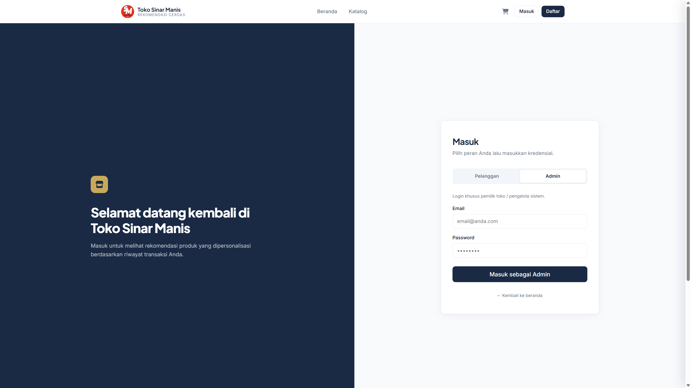

**Penjelasan.**  
Tab Admin menampilkan keterangan *“Login khusus pemilik toko / pengelola sistem.”* Tombol berubah menjadi *Masuk sebagai Admin*. Setelah autentikasi berhasil dengan `role = admin`, pengguna diarahkan ke dashboard admin.

---

### 3.3 Halaman Registrasi Pelanggan

| Atribut | Nilai |
|---------|-------|
| **URL** | `/register` |
| **Route** | `register` / `register.post` |
| **Akses** | Publik (hanya membuat akun pelanggan) |
| **Screenshot** | `screenshots/13-register-user.png` |

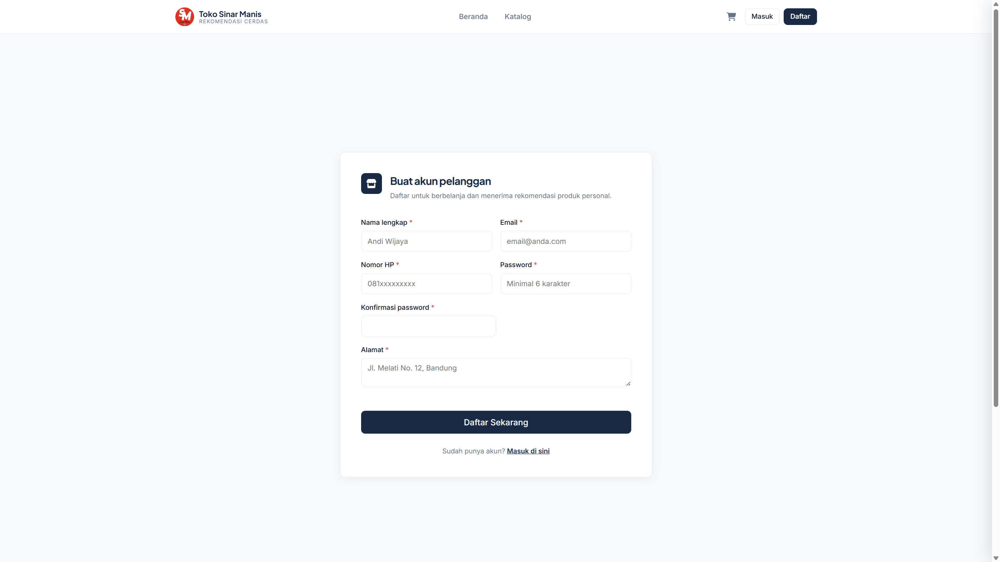

**Penjelasan.**  
Formulir pendaftaran khusus pelanggan. Role `pelanggan` ditetapkan otomatis oleh sistem. Setelah berhasil mendaftar, pengguna diminta masuk melalui halaman login.

**Field wajib:**
- Nama lengkap, Email, Nomor HP
- Password (minimal 6 karakter) dan Konfirmasi password
- Alamat

---

## 4. Modul Pelanggan

### 4.1 Beranda

| Atribut | Nilai |
|---------|-------|
| **URL** | `/` |
| **Route** | `home` |
| **Akses** | Publik |
| **Screenshot** | `screenshots/04-beranda-user.png` |

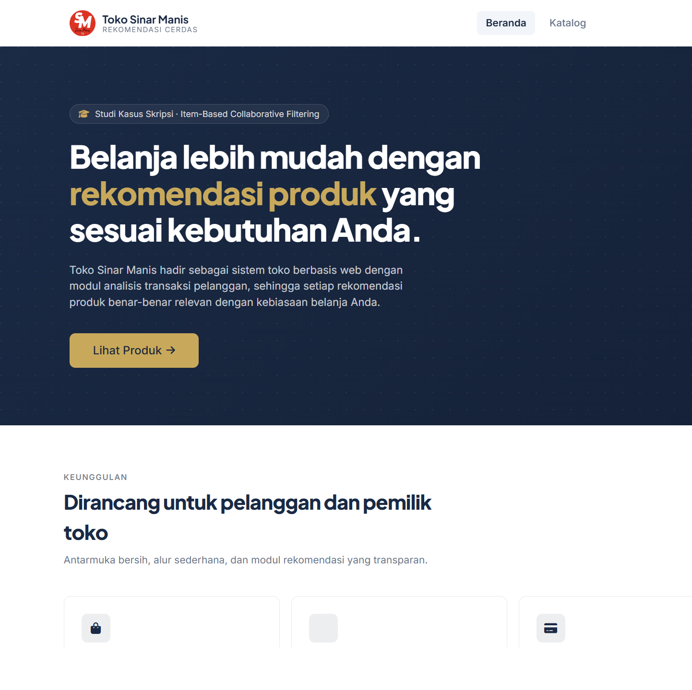

**Penjelasan.**  
Halaman pembuka toko. Bagian hero menjelaskan konsep rekomendasi berbasis Item-Based Collaborative Filtering. Selanjutnya ditampilkan keunggulan sistem, produk unggulan (sering dibeli), serta ringkasan metode rekomendasi. Tombol utama mengarahkan ke katalog atau login/daftar.

**Bagian utama:**
1. Hero — judul, deskripsi singkat, CTA
2. Keunggulan — produk lengkap, rekomendasi personal, transaksi mudah, riwayat tersimpan
3. Produk unggulan — daftar produk terlaris (jika data tersedia)
4. Penjelasan singkat IBCF

---

### 4.2 Katalog Produk

| Atribut | Nilai |
|---------|-------|
| **URL** | `/produk` |
| **Route** | `produk` |
| **Akses** | Publik |
| **Screenshot** | `screenshots/05-katalog-user.png` |

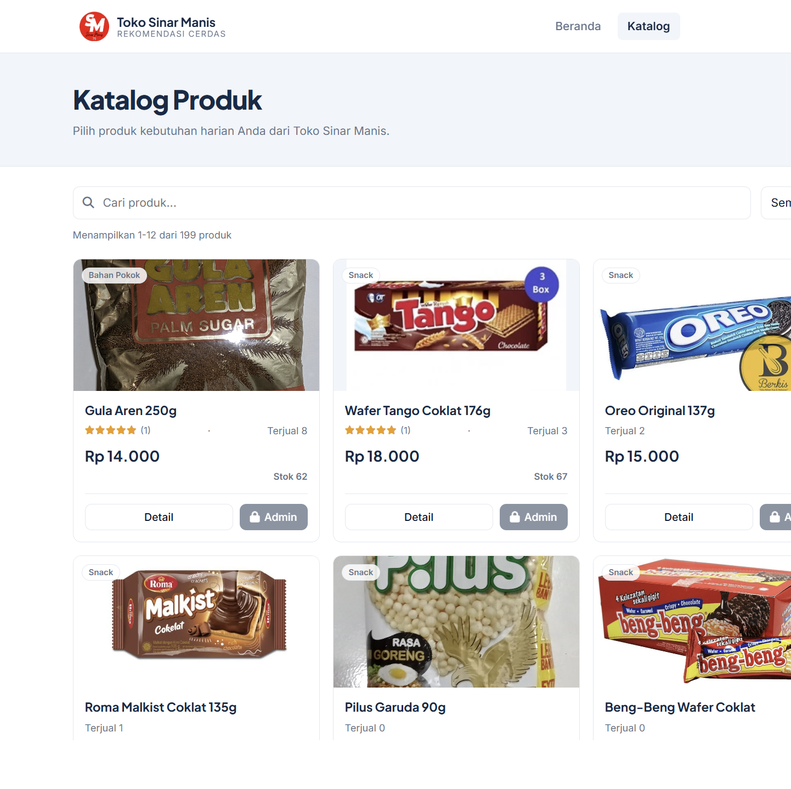

**Penjelasan.**  
Menampilkan daftar produk dalam bentuk grid. Pengguna dapat mencari nama produk, memfilter kategori, dan mengurutkan (terlaris, terbaru, harga termurah/termahal). Setiap kartu produk menampilkan gambar, nama, kategori, harga, rating, serta aksi menuju detail atau menambah ke keranjang.

> Catatan: pada environment lokal saat dokumentasi ini dibuat, katalog menampilkan *empty state* karena data produk belum terisi. Setelah produk diimpor/diisi, grid produk akan muncul pada layout yang sama.

---

### 4.3 Detail Produk

| Atribut | Nilai |
|---------|-------|
| **URL** | `/produk/{id}` |
| **Route** | `produk.detail` |
| **Akses** | Publik |
| **Screenshot** | `screenshots/14-detail-produk.png` |

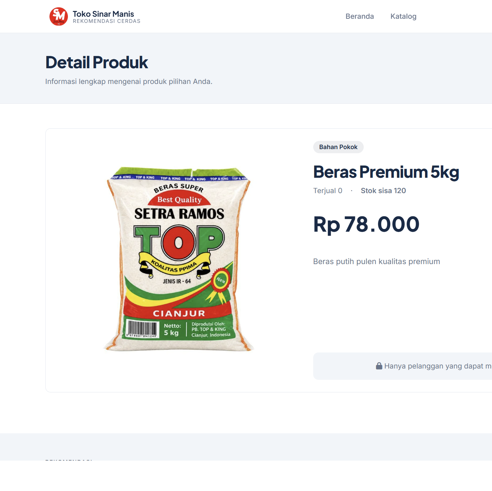

**Penjelasan.**  
Menampilkan informasi lengkap satu produk: gambar, harga, stok, deskripsi, rating, dan ulasan. Pelanggan yang sudah login dapat mengirim ulasan. Di bagian bawah terdapat **Produk Serupa / Sering Dibeli Bersamaan** (hasil kemiripan CF) serta produk dari kategori yang sama sebagai tampilan pendukung.

**Fungsi terkait rekomendasi:**
- Bagian *Produk Serupa* memanfaatkan skor similarity antarproduk
- Filter kategori di sekitar halaman bersifat tampilan tambahan, bukan inti perhitungan CF

---

### 4.4 Keranjang Belanja

| Atribut | Nilai |
|---------|-------|
| **URL** | `/keranjang` |
| **Route** | `keranjang` |
| **Akses** | Publik (session); sinkron ke DB setelah login pelanggan |
| **Screenshot** | `screenshots/06-keranjang-user.png` |

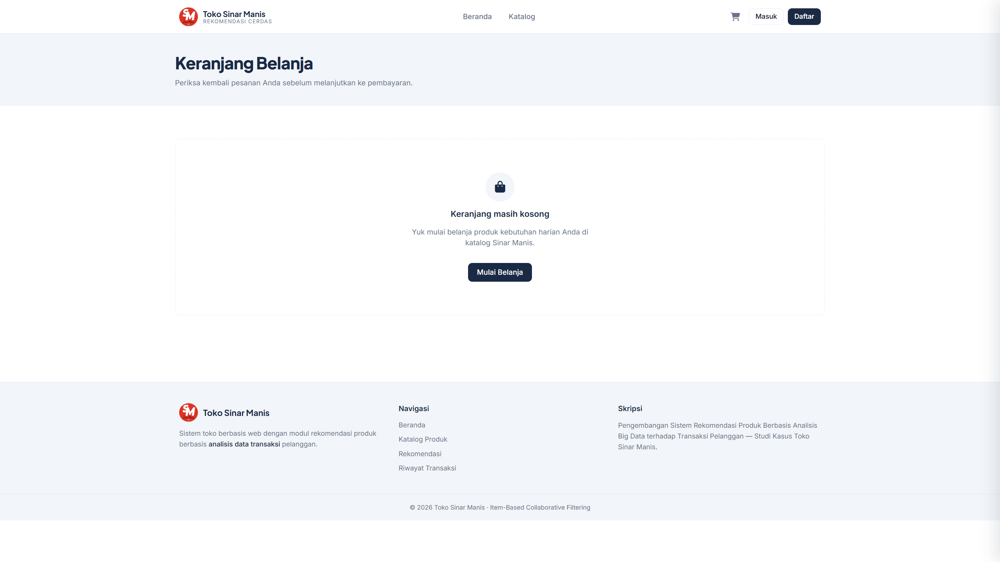

**Penjelasan.**  
Menampilkan item yang dipilih sebelum checkout. Pengguna dapat mengubah kuantitas atau menghapus item. Tombol checkout hanya dapat dilanjutkan bila pengguna login sebagai pelanggan. Jika keranjang kosong, sistem menampilkan empty state dengan tombol *Mulai Belanja*.

**Operasi API keranjang (session):**
- `GET/POST/PUT/DELETE /api/cart`

---

### 4.5 Rekomendasi Produk

| Atribut | Nilai |
|---------|-------|
| **URL** | `/rekomendasi` |
| **Route** | `rekomendasi` |
| **Akses** | Publik (personal setelah login pelanggan) |
| **Screenshot** | `screenshots/01-rekomendasi-user.png` |

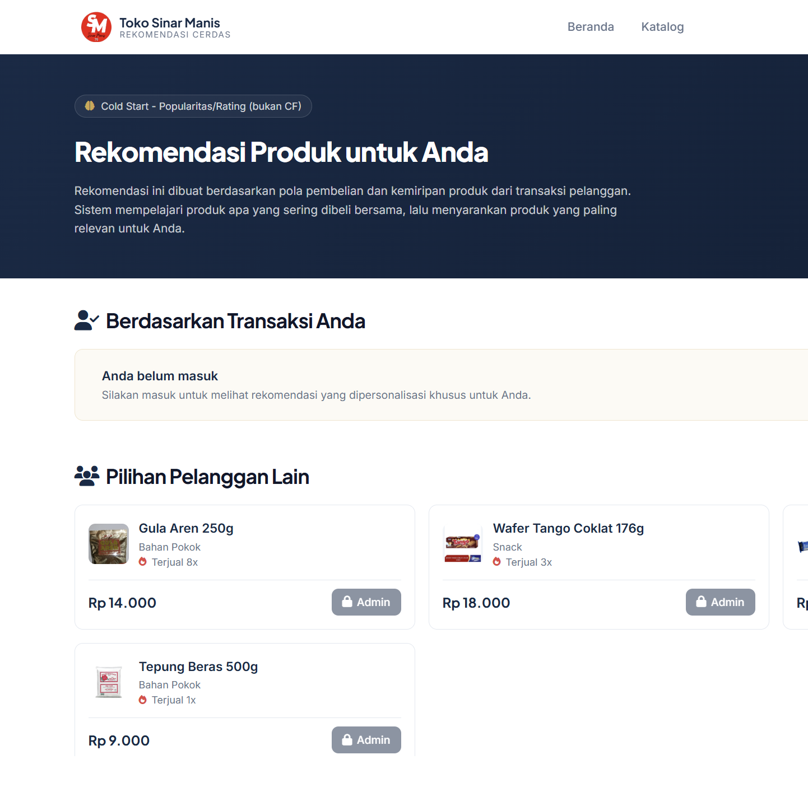

**Penjelasan.**  
Halaman inti modul rekomendasi. Sistem menjelaskan bahwa saran produk dihasilkan dari pola pembelian bersama (matriks interaksi biner) dan cosine similarity antarproduk.

**Kondisi tampilan:**

| Kondisi | Perilaku UI |
|---------|-------------|
| Tamu (belum login) | Alert “Anda belum masuk” + ajakan login; dapat menampilkan fallback/populer |
| Pelanggan tanpa riwayat cukup | Rekomendasi alternatif / produk populer |
| Pelanggan dengan riwayat valid | Daftar rekomendasi personal “Berdasarkan Transaksi Anda” |

**Alur konseptual (ditampilkan juga di halaman):**
1. Ambil transaksi valid (Selesai + Dibayar) sebagai matriks interaksi biner  
2. Hitung kemiripan produk (Item-Based CF — cosine similarity)  
3. Agregasi skor prediksi dari riwayat belanja pengguna, lalu diurutkan  

---

### 4.6 Checkout

| Atribut | Nilai |
|---------|-------|
| **URL** | `/checkout` |
| **Route** | `checkout` / `checkout.store` |
| **Akses** | Autentikasi + peran pelanggan |
| **Screenshot** | `screenshots/07-checkout-user.png` |

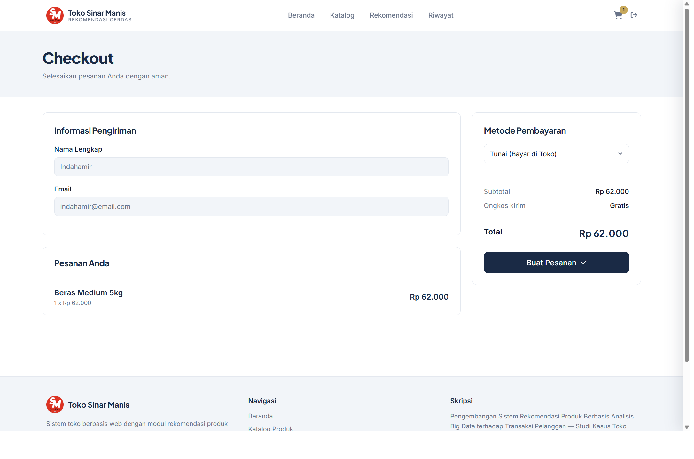

**Penjelasan.**  
Halaman penyelesaian pesanan. Menampilkan ringkasan item di keranjang, data pengiriman (dari profil pelanggan), subtotal/ongkir/total, serta pilihan metode pembayaran:

1. **Tunai (Bayar di Toko)** — pesanan dicatat untuk diambil/dibayar di toko  
2. **Online Payment (Midtrans)** — pembayaran daring (Snap), bila konfigurasi Midtrans aktif  

Tombol **Buat Pesanan** menyimpan transaksi; statusnya kemudian dapat dipantau di Riwayat maupun panel admin.

---

### 4.7 Riwayat Transaksi

| Atribut | Nilai |
|---------|-------|
| **URL** | `/riwayat` |
| **Route** | `riwayat` |
| **Akses** | Autentikasi + peran pelanggan |
| **Screenshot** | `screenshots/08-riwayat-user.png` |

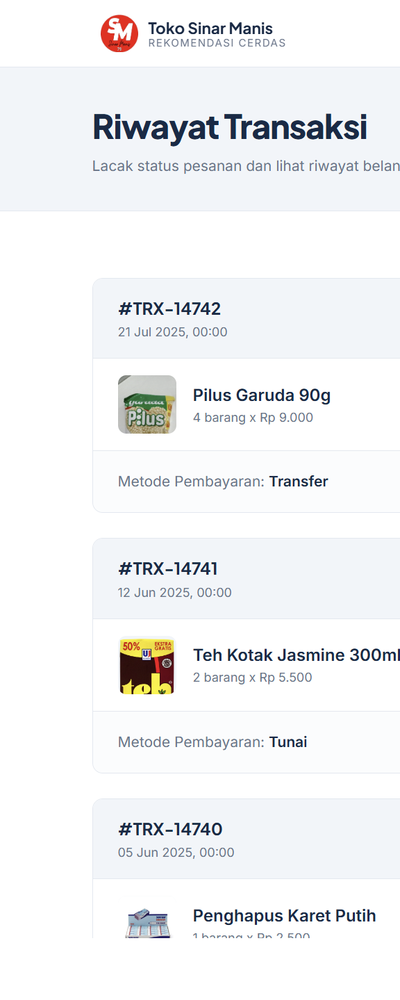

**Penjelasan.**  
Daftar pesanan pelanggan beserta status pembayaran dan status pesanan (misalnya *Dibayar* / *Selesai*). Setiap kartu transaksi menampilkan ID, tanggal, item produk, metode pembayaran, dan total belanja. Untuk pembayaran Midtrans, tersedia aksi verifikasi status bila diperlukan.

---

## 5. Modul Admin

Semua halaman admin memakai layout sidebar dan dilindungi middleware `auth` + `AdminMiddleware`.

### 5.1 Dashboard Admin

| Atribut | Nilai |
|---------|-------|
| **URL** | `/admin` |
| **Route** | `admin.dashboard` |
| **Akses** | Admin |
| **Screenshot** | `screenshots/09-admin-dashboard.png` |

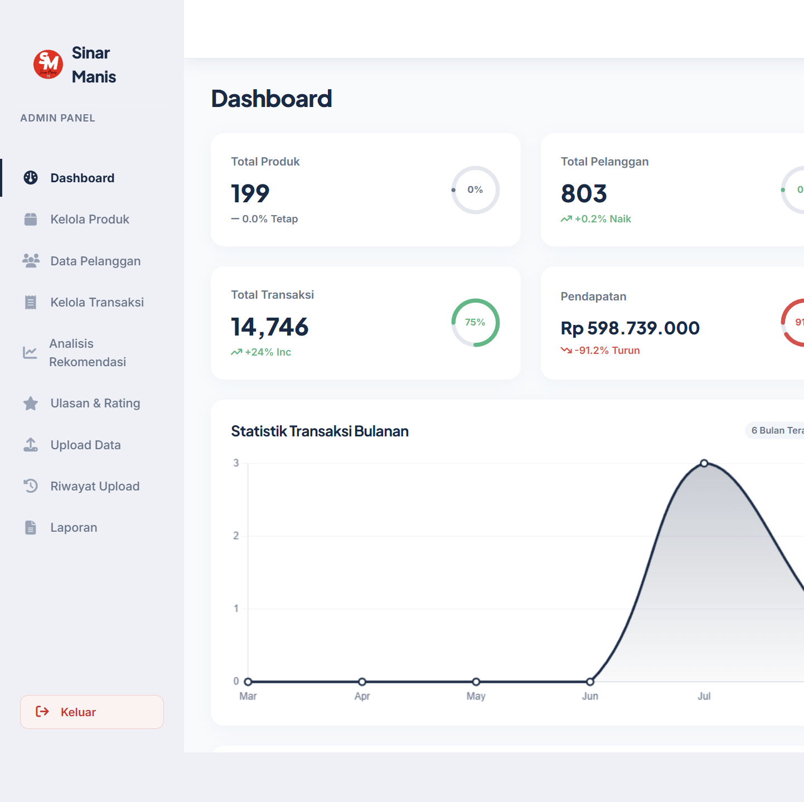

**Penjelasan.**  
Ringkasan operasional toko: jumlah produk, pelanggan, transaksi, dan pendapatan. Menampilkan grafik statistik transaksi bulanan, kategori paling diminati, serta daftar transaksi terbaru sebagai pantauan cepat bagi pemilik toko.

---

### 5.2 Kelola Produk

| Atribut | Nilai |
|---------|-------|
| **URL** | `/admin/produk` |
| **Route** | `admin.produk` |
| **Akses** | Admin |
| **Screenshot** | `screenshots/15-admin-produk.png` |

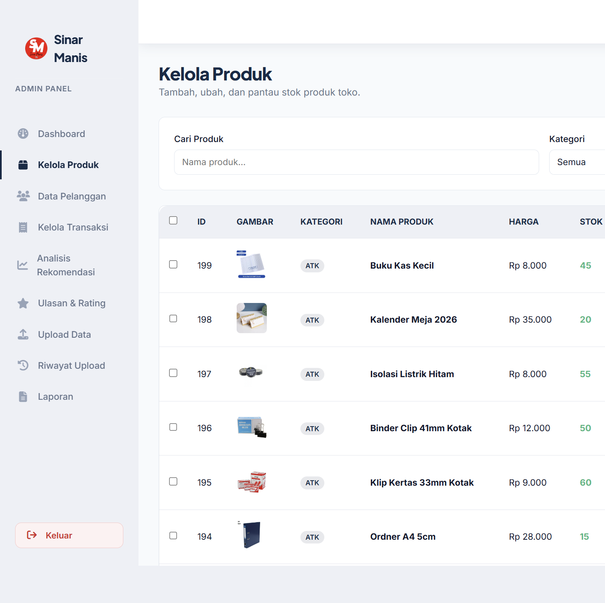

**Penjelasan.**  
CRUD produk: tambah, ubah, hapus (termasuk bulk delete), unggah gambar, filter berdasarkan nama/kategori/status, serta paginasi. Produk aktif akan tampil di katalog pelanggan.

**Aksi utama:**
- Tombol *Tambah Produk* (modal)
- Filter pencarian, kategori, status
- Edit / hapus per baris atau massal

---

### 5.3 Data Pelanggan

| Atribut | Nilai |
|---------|-------|
| **URL** | `/admin/pelanggan` |
| **Route** | `admin.pelanggan` |
| **Akses** | Admin |
| **Screenshot** | `screenshots/10-admin-pelanggan.png` |

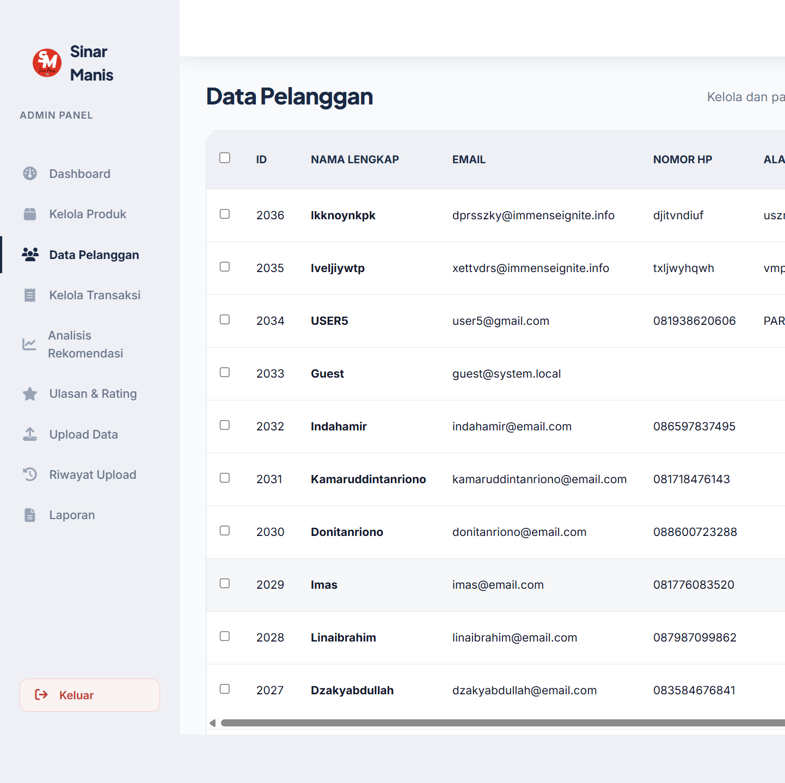

**Penjelasan.**  
Daftar akun pelanggan (nama, email, kontak, status, jumlah transaksi). Admin dapat melihat riwayat transaksi per pelanggan (modal/detail) dan melakukan penghapusan massal bila diperlukan.

---

### 5.4 Kelola Transaksi

| Atribut | Nilai |
|---------|-------|
| **URL** | `/admin/transaksi` |
| **Route** | `admin.transaksi` |
| **Akses** | Admin |
| **Screenshot** | `screenshots/16-admin-transaksi.png` |

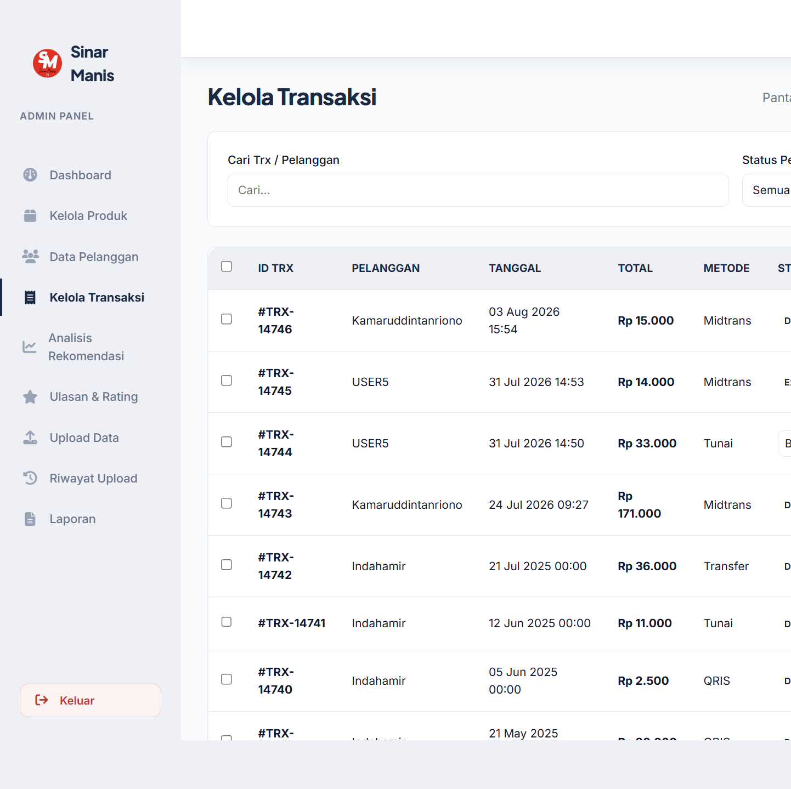

**Penjelasan.**  
Pemantauan seluruh pesanan. Admin dapat memfilter berdasarkan kata kunci, status pembayaran, status pesanan, dan rentang tanggal. Status dapat diperbarui (misalnya pembayaran menjadi *Dibayar*, pesanan menjadi *Selesai*). Detail item ditampilkan melalui modal.

Transaksi dengan status valid (Dibayar + Selesai) menjadi bahan perhitungan similarity CF.

---

### 5.5 Analisis Rekomendasi

| Atribut | Nilai |
|---------|-------|
| **URL** | `/admin/analisis` |
| **Route** | `admin.analisis` |
| **Akses** | Admin |
| **Screenshot** | `screenshots/17-admin-analisis.png` |

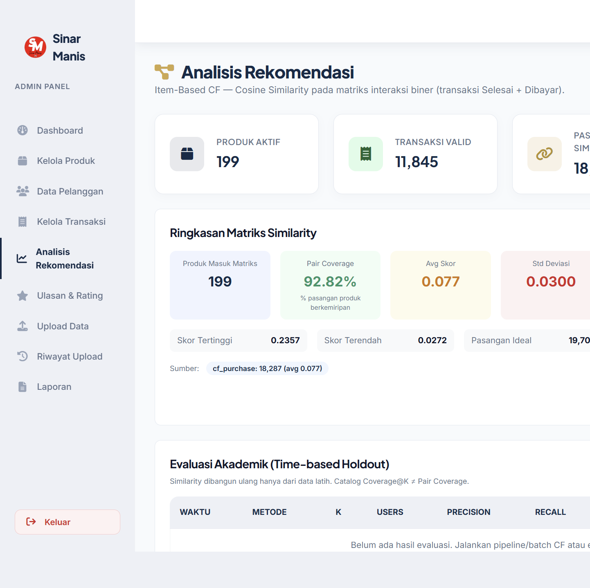

**Penjelasan.**  
Panel analisis model rekomendasi. Menampilkan statistik produk aktif, transaksi valid, pasangan similarity, ringkasan matriks, evaluasi akademik, serta daftar pasangan kemiripan. Tombol **Hitung Ulang** menjalankan perhitungan ulang cosine similarity agar model mengikuti data transaksi terbaru.

Jika ada transaksi valid baru sejak kalkulasi terakhir, sistem menampilkan peringatan bahwa model perlu dihitung ulang.

---

### 5.6 Ulasan & Rating

| Atribut | Nilai |
|---------|-------|
| **URL** | `/admin/reviews` |
| **Route** | `admin.reviews` |
| **Akses** | Admin |
| **Screenshot** | `screenshots/12-admin-ulasan-rating.png` |

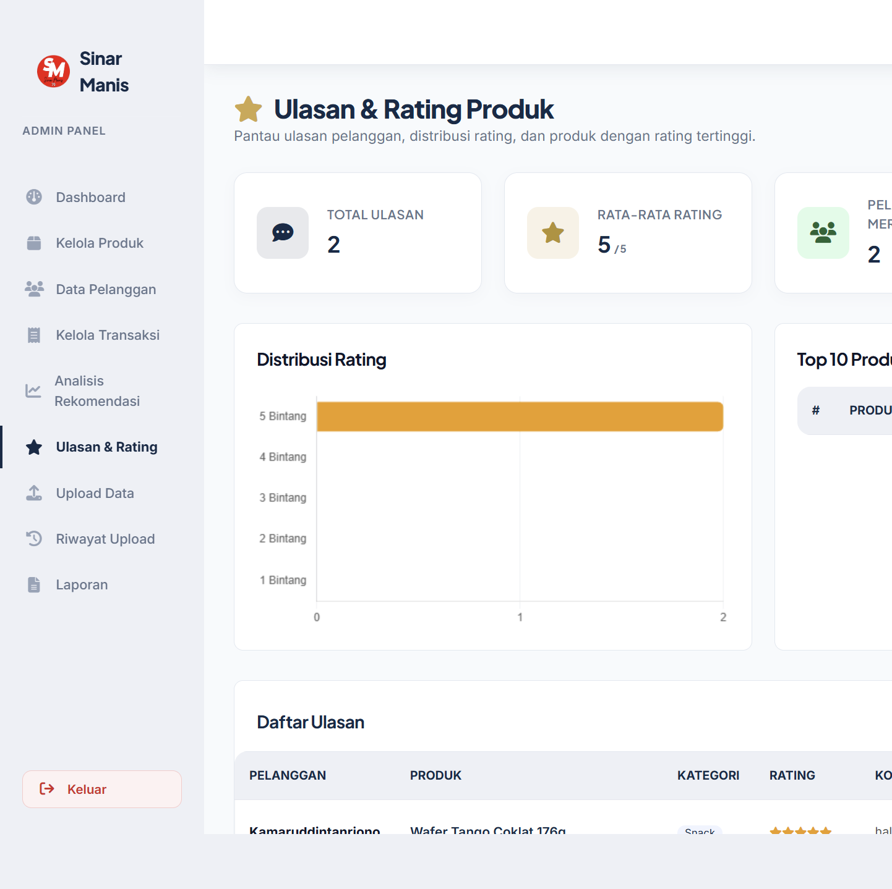

**Penjelasan.**  
Daftar seluruh ulasan pelanggan terhadap produk, distribusi rating, dan top produk berating tinggi. Rating digunakan sebagai penyempurnaan ranking (hybrid scoring), sementara inti CF tetap berbasis interaksi transaksi biner.

---

### 5.7 Upload Data

| Atribut | Nilai |
|---------|-------|
| **URL** | `/admin/upload` |
| **Route** | `admin.upload` |
| **Akses** | Admin |
| **Screenshot** | `screenshots/18-admin-upload.png` |

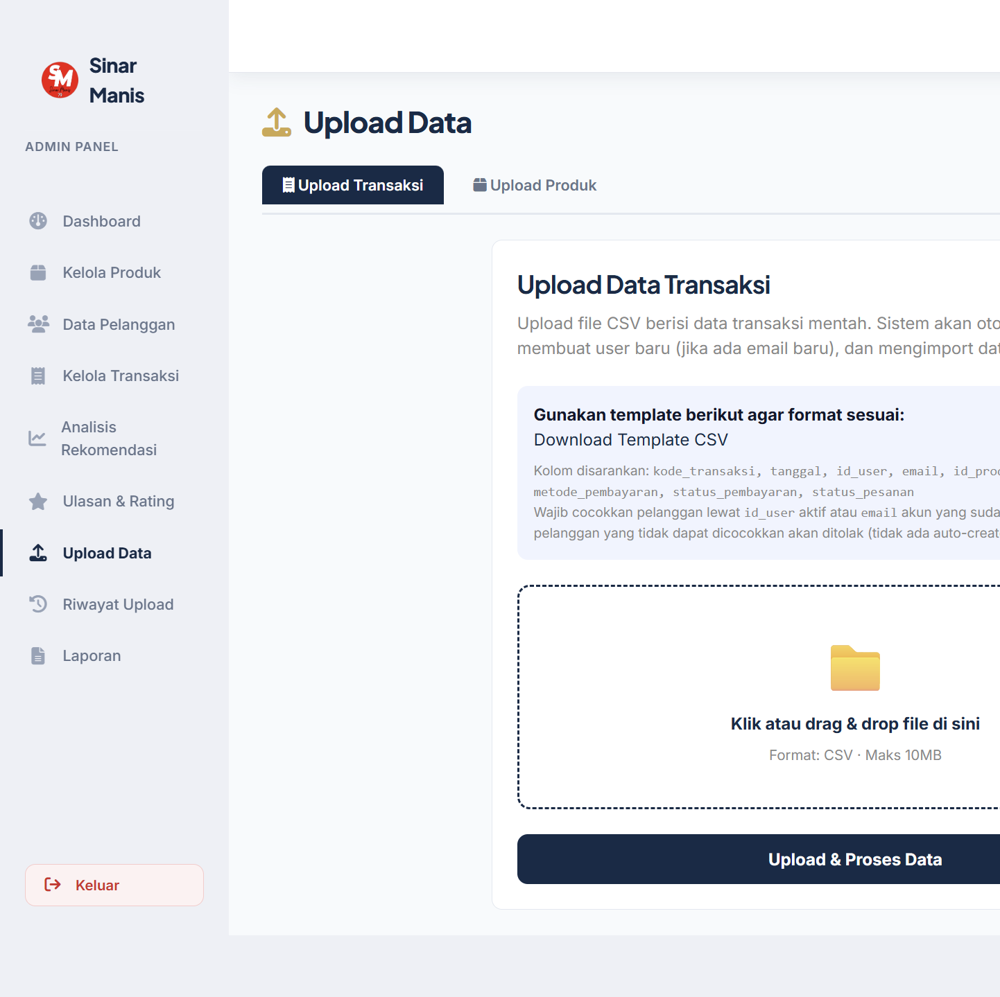

**Penjelasan.**  
Halaman unggah data CSV dengan dua tab:

| Tab | Fungsi |
|-----|--------|
| **Upload Transaksi** | Mengunggah data transaksi mentah → pipeline Python (ETL + CF) |
| **Upload Produk** | Import produk massal (termasuk kolom opsional `foto`) |

Tersedia unduhan template CSV agar format kolom sesuai. Baris transaksi yang tidak dapat dicocokkan ke pelanggan yang sudah ada akan ditolak (tidak ada auto-create password default).

---

### 5.8 Riwayat Upload

| Atribut | Nilai |
|---------|-------|
| **URL** | `/admin/upload-history` |
| **Route** | `admin.upload-history` |
| **Akses** | Admin |
| **Screenshot** | `screenshots/11-admin-riwayat-upload.png` |

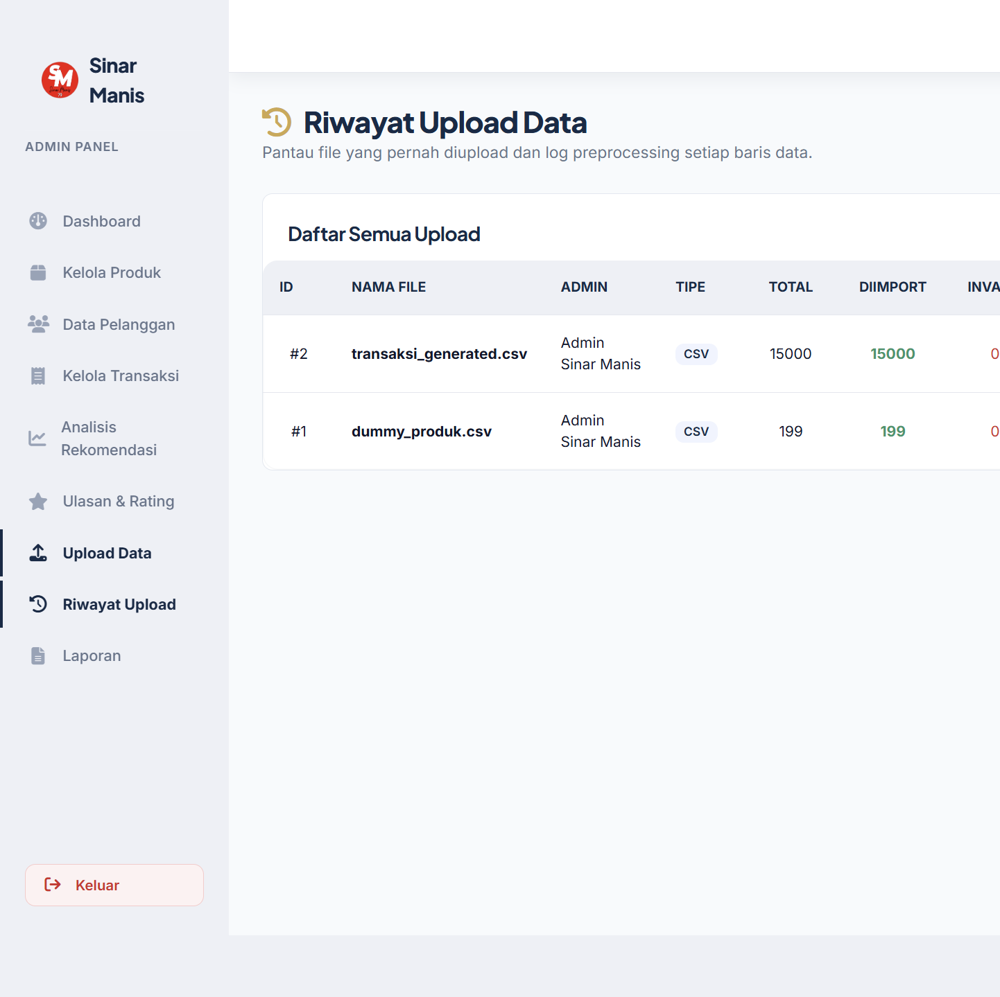

**Penjelasan.**  
Mencatat riwayat unggahan data (status, waktu, ringkasan hasil). Detail satu unggahan dapat dibuka melalui parameter `?id={id_upload}` pada halaman yang sama.

---

### 5.9 Laporan Transaksi

| Atribut | Nilai |
|---------|-------|
| **URL** | `/admin/laporan` |
| **Route** | `admin.laporan` |
| **Akses** | Admin |
| **Screenshot** | `screenshots/19-admin-laporan.png` |

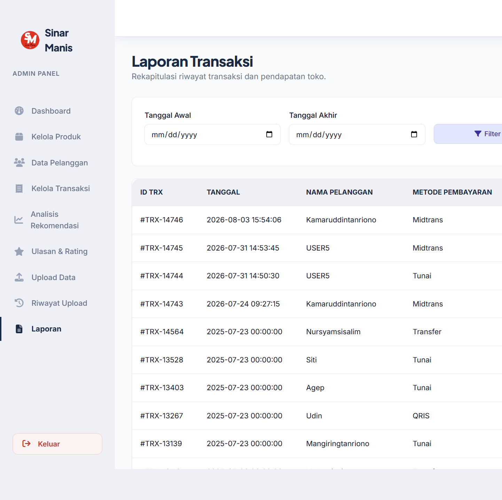

**Penjelasan.**  
Rekapitulasi transaksi dan pendapatan dalam rentang tanggal tertentu. Mendukung filter tanggal, export PDF, export Excel, dan cetak.

---

## 6. Catatan Pengambilan Screenshot

Semua screenshot diambil dari website live `https://sinarmanis.muhzule.com` (tampilan UI halaman, bukan diagram sequence).

### 6.1 Screenshot yang sudah tersedia

| File | Halaman |
|------|---------|
| `01-rekomendasi-user.png` | Rekomendasi |
| `02-login-admin.png` | Login tab Admin |
| `03-login-user.png` | Login tab Pelanggan |
| `04-beranda-user.png` | Beranda |
| `05-katalog-user.png` | Katalog (199 produk) |
| `06-keranjang-user.png` | Keranjang |
| `07-checkout-user.png` | Checkout (pelanggan) |
| `08-riwayat-user.png` | Riwayat Transaksi (pelanggan) |
| `09-admin-dashboard.png` | Dashboard Admin |
| `10-admin-pelanggan.png` | Data Pelanggan |
| `11-admin-riwayat-upload.png` | Riwayat Upload |
| `12-admin-ulasan-rating.png` | Ulasan & Rating |
| `13-register-user.png` | Registrasi |
| `14-detail-produk.png` | Detail Produk |
| `15-admin-produk.png` | Kelola Produk |
| `16-admin-transaksi.png` | Kelola Transaksi |
| `17-admin-analisis.png` | Analisis Rekomendasi |
| `18-admin-upload.png` | Upload Data |
| `19-admin-laporan.png` | Laporan |

### 6.2 Kelengkapan

Screenshot halaman utama pelanggan dan admin sudah lengkap, termasuk Checkout dan Riwayat.

---

## Lampiran — Daftar URL Cepat

Base URL: `https://sinarmanis.muhzule.com`

| Modul | URL |
|-------|-----|
| Beranda | `/` |
| Login | `/login` |
| Daftar | `/register` |
| Katalog | `/produk` |
| Detail Produk | `/produk/{id}` |
| Keranjang | `/keranjang` |
| Rekomendasi | `/rekomendasi` |
| Checkout | `/checkout` |
| Riwayat | `/riwayat` |
| Admin Dashboard | `/admin` |
| Admin Produk | `/admin/produk` |
| Admin Pelanggan | `/admin/pelanggan` |
| Admin Transaksi | `/admin/transaksi` |
| Admin Analisis | `/admin/analisis` |
| Admin Ulasan | `/admin/reviews` |
| Admin Upload | `/admin/upload` |
| Admin Riwayat Upload | `/admin/upload-history` |
| Admin Laporan | `/admin/laporan` |

---

*Dokumen ini merupakan bagian dari dokumentasi sistem Toko Sinar Manis — Pengembangan Sistem Rekomendasi Produk Berbasis Analisis Data terhadap Transaksi Pelanggan menggunakan Item-Based Collaborative Filtering.*
