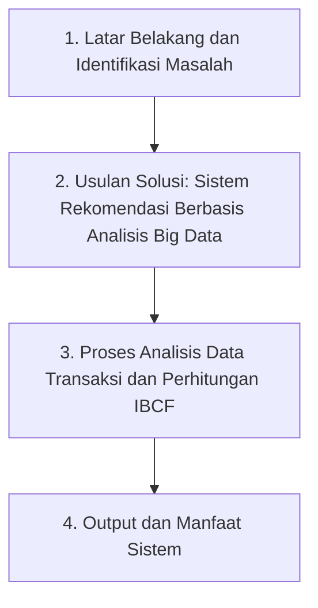

# Kerangka Pikir Penelitian

## Judul

**Pengembangan Sistem Rekomendasi Produk Berbasis Analisis Big Data terhadap Transaksi Pelanggan (Studi Kasus Toko Sinar Manis)**

---

## Diagram Alur Kerangka Pikir

---

## Uraian Kerangka Pikir

### 1. Latar Belakang dan Identifikasi Masalah

Penelitian ini dilatarbelakangi oleh permasalahan dalam proses pemilihan produk pada Toko Sinar Manis yang masih cenderung dilakukan secara manual, sehingga pelanggan mengalami kesulitan menemukan produk yang relevan dengan kebutuhan dan kebiasaan belanjanya. Di sisi lain, toko menghasilkan **volume data transaksi pelanggan yang terus bertambah** dari aktivitas penjualan harian. Data tersebut potensial mengandung pola pembelian bersama antarproduk, namun belum diolah secara sistematis melalui pendekatan analisis data sehingga belum menghasilkan informasi yang bermanfaat bagi pelanggan maupun pihak toko.

---

### 2. Usulan Solusi: Sistem Rekomendasi Berbasis Analisis Big Data

Berdasarkan permasalahan tersebut, diperlukan suatu sistem yang mampu **menganalisis data transaksi pelanggan dalam skala besar** dan mengubahnya menjadi rekomendasi produk yang relevan. Oleh karena itu, penelitian ini mengusulkan pengembangan **sistem rekomendasi produk berbasis analisis big data terhadap transaksi pelanggan**, dengan metode inti **Item-Based Collaborative Filtering (IBCF)**. Sistem memanfaatkan data historis transaksi sebagai sumber utama analisis, sehingga rekomendasi dibangun dari perilaku pembelian nyata, bukan hanya dari pencarian atau pemilihan manual pelanggan.

---

### 3. Proses Analisis Data Transaksi dan Perhitungan IBCF

Data transaksi yang terkumpul melalui sistem (checkout digital maupun unggahan data historis) diproses melalui tahapan **analisis data**, meliputi:

1. **Pengumpulan data** — transaksi pelanggan beserta item produk yang dibeli;
2. **Preprocessing** — pembersihan data, seleksi transaksi valid (`Dibayar` + `Selesai`), serta transformasi ke bentuk **matriks interaksi user–item** (biner);
3. **Analisis pola** — perhitungan tingkat kemiripan antarproduk menggunakan **cosine similarity** pada pendekatan Item-Based Collaborative Filtering;
4. **Pemeringkatan rekomendasi** — produk dengan skor kemiripan tinggi terhadap riwayat belanja pengguna disusun menjadi daftar rekomendasi personal.

Hasil perhitungan kemiripan disimpan dan digunakan oleh aplikasi web Toko Sinar Manis untuk menampilkan rekomendasi kepada pelanggan (halaman rekomendasi dan produk serupa).

---

### 4. Output dan Manfaat Sistem

Output dari sistem ini berupa **daftar rekomendasi produk yang relevan** berdasarkan riwayat transaksi pelanggan, serta modul pendukung bagi admin untuk mengelola data, memantau transaksi, dan mengevaluasi hasil analisis rekomendasi. Dengan adanya sistem ini, diharapkan pelanggan lebih mudah menemukan produk yang sesuai kebutuhan, sementara pihak toko dapat memanfaatkan data transaksi secara lebih optimal untuk mendukung efektivitas penjualan dan pengambilan keputusan berbasis data.

---

## Ringkasan Logika Penelitian

| Tahap | Inti |
|-------|------|
| Masalah | Pemilihan produk manual; data transaksi belum dianalisis secara optimal |
| Pendekatan | Analisis big data terhadap transaksi pelanggan |
| Metode | Item-Based Collaborative Filtering + Cosine Similarity |
| Proses | Kumpulkan → bersihkan → matriks user–item → hitung similarity → rekomendasi |
| Hasil | Rekomendasi personal bagi pelanggan; wawasan data bagi toko |

---

## Catatan Penyusunan (untuk BAB kerangka pikir)

- Istilah **analisis big data** pada kerangka ini dimaknai sebagai analisis terhadap **volume data transaksi pelanggan** yang besar dan terus bertambah, melalui tahapan pengumpulan, pembersihan, transformasi, dan penambangan pola pembelian.
- Metode teknis yang diimplementasikan pada sistem adalah **IBCF dengan cosine similarity** pada matriks interaksi biner (transaksi valid).
- Diagram visual siap diedit juga tersedia pada file: `docs/kerangka-pikir.drawio` (buka dengan [diagrams.net](https://app.diagrams.net/)).
